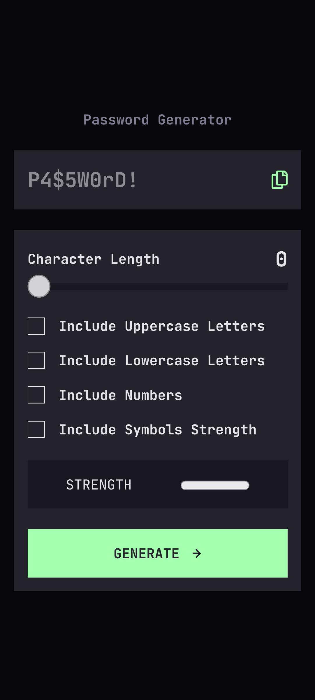
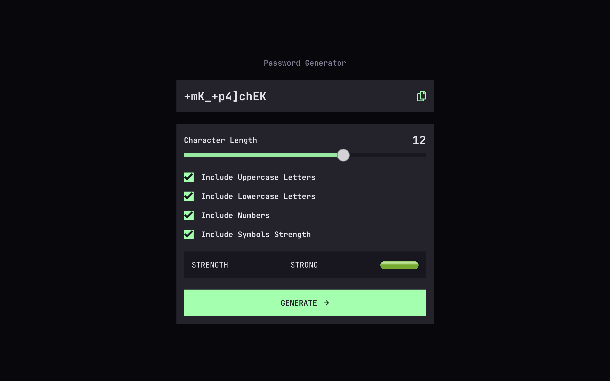

# Frontend Mentor - Password generator app solution

This is a solution to the [Password generator app challenge on Frontend Mentor](https://www.frontendmentor.io/challenges/password-generator-app-Mr8CLycqjh). Frontend Mentor challenges help you improve your coding skills by building realistic projects.

## Table of contents

- [Overview](#overview)
  - [The challenge](#the-challenge)
  - [Screenshot](#screenshot)
  - [Links](#links)
- [My process](#my-process)
  - [Built with](#built-with)
  - [What I learned](#what-i-learned)
  - [Continued development](#continued-development)
  - [Useful resources](#useful-resources)
- [Author](#author)

## Overview

### The challenge

Users should be able to:

- Generate a password based on the selected inclusion options
- Copy the generated password to the computer's clipboard
- See a strength rating for their generated password
- View the optimal layout for the interface depending on their device's screen size
- See hover and focus states for all interactive elements on the page

### Screenshot





### Links

- Solution URL: [Add solution URL here](https://your-solution-url.com)
- Live Site URL: [Add live site URL here](https://your-live-site-url.com)

## My process

### Built with

- Semantic HTML5 markup
- CSS custom properties
- Flexbox
- Mobile-first workflow

### What I learned

```js
const displayCopiedText = () => {
	copyText.style.display = "block";
};

const copyPassword = async () => {
	const copiedPassword = passwordText.value;
	try {
		await navigator.clipboard.writeText(copiedPassword);
		displayCopiedText();
	} catch (error) {
		console.log(error);
	}
};
```

### Continued development

- Event Loops
- Promises

### Useful resources

- [Interactive Guide to Clipboard API](https://rapidapi.com/guides/clipboard-api) - This article provides an example on how to use the Clipboard API. The steps by steps guide on how to use the API is really helpful.
- [How TO - Range Sliders](https://www.w3schools.com/howto/howto_js_rangeslider.asp) - This lesson provided examples how to create and customize range slider with css

## Author

- Frontend Mentor - [@mayor-creator](https://www.frontendmentor.io/profile/mayor-creator)
- Threads - [@mayor_creator](https://www.threads.net/@mayor_creator)
